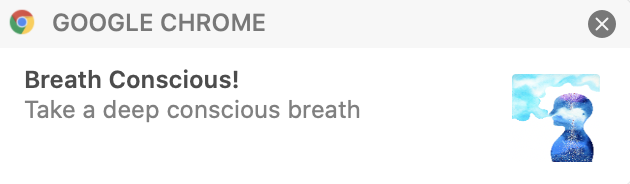

# conscious-breathing-chrome-extension
A regular reminder for conscious breathing, after every 15 minutes via chrome extension notifications

# Installation

Download/Clone the repository onto your local system
```
1) Open the Extension Management page by navigating to chrome://extensions OR The Extension Management page can also be opened by clicking on the Chrome menu, hovering over More Tools then selecting Extensions.
2) Enable Developer Mode by clicking the toggle switch next to Developer mode.
3) Click the LOAD UNPACKED button and select the extension directory where code has been downloaded/cloned.
```

# Notification Image


# Credits

https://github.com/wlin53/chrome-reminder-extension
